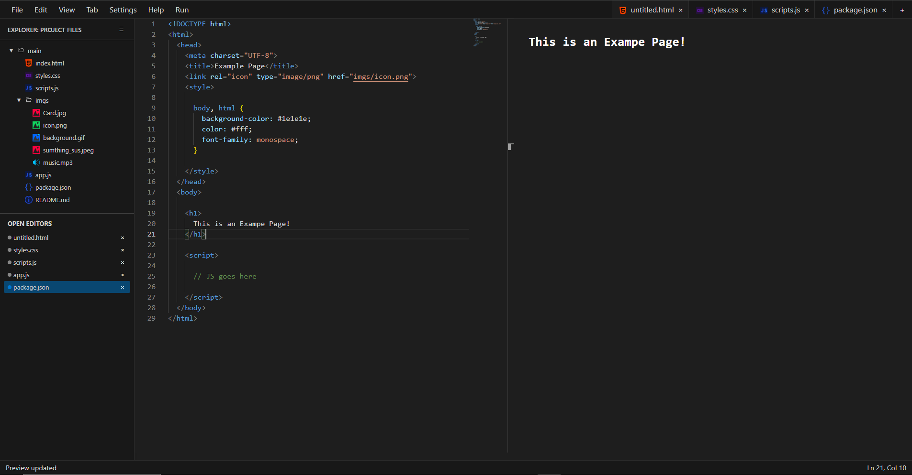
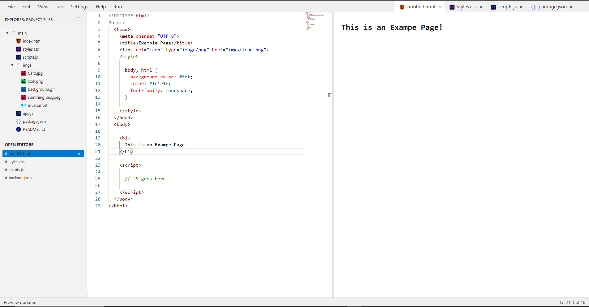

# HTML IDE

A lightweight, in-browser HTML editor and live previewer. This project provides a clean, responsive interface to write, edit, and preview HTML / CSS / JavaScript code directly in your browser. It includes features like tabbed editing, file management, themes, and a real-time preview pane.

## Goles as an IDE
 - **offline** - It must work with no internet
 - **Browser Only** - It must work completely in the browser 

## Features

- **Tabbed Code Editing** – Open and switch between multiple files with a built-in tab bar.
- **Live Preview** – See your HTML output update instantly as you type.
- **File Explorer** – Create, rename, and delete files in a sidebar for easy organization.
- **Themes** – Switch between default, light, dark, and high-contrast themes.
- **Import/Export** – Load local files or download your work.
- **Status Bar** – Displays filename and editor status.
- **Resizable Layout** – Drag to resize the editor and preview panes.
- **Responsive Design** – Works well on both desktop and mobile devices.

## Technologies Used

- **HTML5** – Layout and structure.
- **CSS3** – Styling, theming, and responsive layout.
- **JavaScript (Vanilla)** – File handling, event logic, dynamic UI updates.

## How to Use

1. Open `index.html` in your browser.
2. Start typing HTML, CSS, or JS in the editor window.
3. View live output in the right-hand preview pane.
4. Use the menu bar to manage files, themes, and tabs.

## Installation

1. scroll up and click the green "Code" button
2. click "Download ZIP" and save it
3. find it in your file explorer app and hit extract all
4. find index.html in the folder

notes:
<ul>
  once you extract all you can now delete the ZIP or keep it as a back up of some sort
</ul>

## Screenshots

 

## Future Improvements

- Better tab features
- Drag-and-drop file support
- Further theme support
- Better file system
- More icons and stuff
- etc.
- etc.